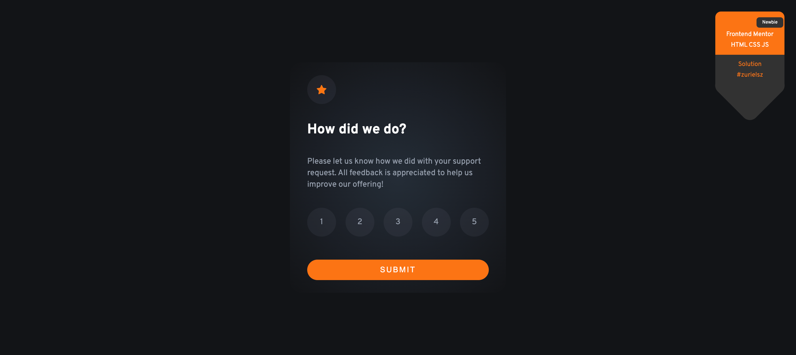
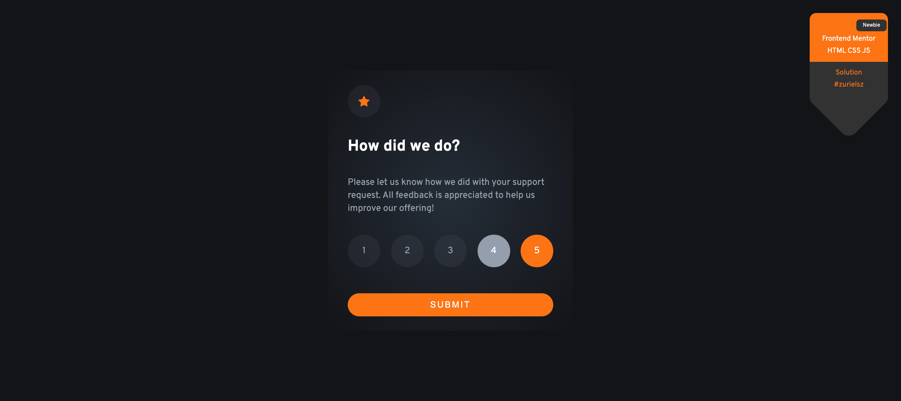
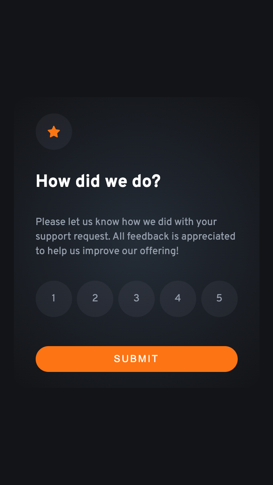

# Practice Project: Satisfaction Survey

This practice project focuses on the layout of an HTML card containing a satisfaction survey. Users can rate from 1 to 5, and a message will be displayed indicating that the rating has been successfully registered.

## Skills Practiced

- HTML Markup
- CSS Styling
- JavaScript Interactivity

## Table of Contents

1. [File Structure](#file-structure)
2. [How to Run the Project](#how-to-run-the-project)
3. [Preview](#preview)
4. [Links](#links)
5. [Future Improvements](#future-improvements)
6. [Contributions](#contributions)
7. [License](#license)
8. [Author](#author)

- [Spanish](#Spanish)

## File Structure

```
.
├── index.html
├── LICENSE
├── README.md
└── assets
    ├── css
    │   └── main.css
    ├── icons
    │   └── icon-star.svg
    ├── img
    │   └── illustration-thank-you.svg
    └── js
        └── main.js
```

## How to Run the Project

1. Clone the repository or download the code to your local machine.
2. Open the `index.html` file in your web browser.
3. Select a rating from 1 to 5.
4. Click the "Submit" button.
5. You will see a message indicating that the rating has been successfully registered.

## Preview





## Links

- Solution URL: [GitHub](https://github.com/zurielsz/evaluator)
- Live Site URL: [Solution](https://interactivefm.netlify.app)

## Future Improvements

- Add animations to enhance the user experience.
- Implement data storage functionality to maintain a record of ratings.

## Contributions

Contributions are welcome! If you'd like to enhance this project, feel free to fork it and submit a pull request.

## License

This project is under the [MIT License](LICENSE).

## Author

- Website - [zurielsz](https://github.com/zurielsz)
- Frontend Mentor - [@zurielzs](https://www.frontendmentor.io/profile/zurielsz)
- Linkedin - [@rszurielsm](https://www.linkedin.com/in/rszurielsm)
